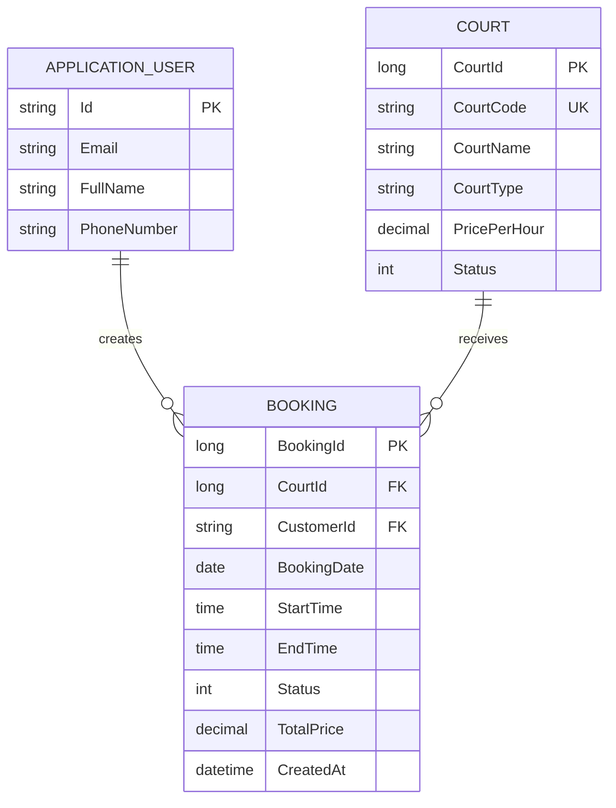

# Domain and Database Design

## Domain objects

- **ApplicationUser**: Identity account with FullName, email, phone, password, and roles.
- **Court**: CourtCode, CourtName, CourtType, PricePerHour, and CourtStatus.
- **Booking**: Court, Customer, date, start/end time, status, total price, and creation time.
- **BookingStatus**: Pending, Confirmed, Cancelled, Expired, Completed.
- **CourtStatus**: Active, Maintenance, Inactive.

## Relationships

- One `ApplicationUser` can own many `Booking` records through CustomerId.
- One `Court` can have many `Booking` records through CourtId.
- Booking requires exactly one Customer and one Court.
- Court deletion is restricted when bookings exist.
- User deletion is restricted when bookings exist.

## ERD

## Constraints and indexes

- CourtCode is unique.
- CourtId and CustomerId are required foreign keys.
- Delete behavior for Court and User is Restrict.
- Active status is required for new bookings.
- Overlap is checked for the same CourtId and BookingDate where status is Pending or Confirmed.
- Recommended production index: `(court_id, booking_date, status, start_time, end_time)` for availability queries.
- Money values should use a deliberate fixed precision in the production schema.
