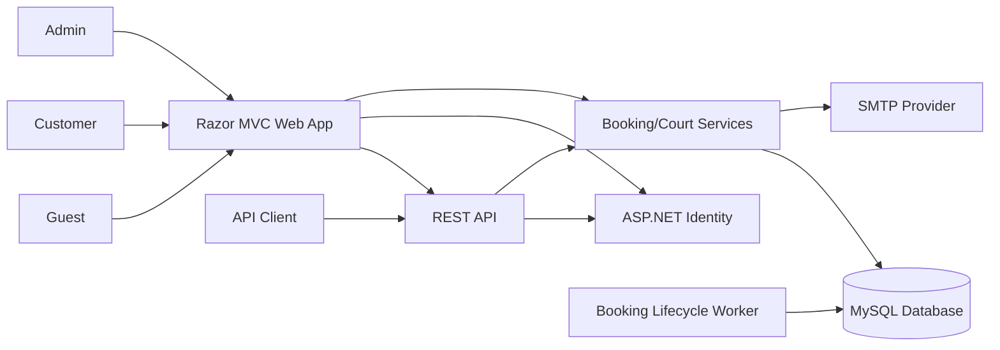

# System Design

## System context

## Containers/modules

- **Razor UI**: Home, Courts, Bookings, Admin, and Identity pages.
- **API layer**: CourtsApiController, BookingsApiController, SecurityApiController.
- **Application services**: CourtService and BookingService own business rules.
- **Background processing**: BookingLifecycleWorker changes overdue states.
- **Persistence**: AppDbContext, EF Core migrations, and MySQL.
- **Cross-cutting**: Identity, cookie authorization, CSRF, rate limiting, exception handler, health check, and SMTP.

## Request flow

1. Request enters routing and forwarded-header middleware.
2. Authentication establishes the Identity principal.
3. Authorization applies controller/role policy.
4. Controller validates input and calls an application service.
5. Service applies business rules and persists through AppDbContext.
6. MVC returns a Razor view or API returns a DTO/status code.

## Error handling

- Missing court/booking maps to 404.
- Business conflicts map to 409.
- API authentication failures return 401/403 instead of HTML redirects.
- Unexpected errors return a generic 500 message.
- Health endpoint returns 503 when the database cannot be reached.
