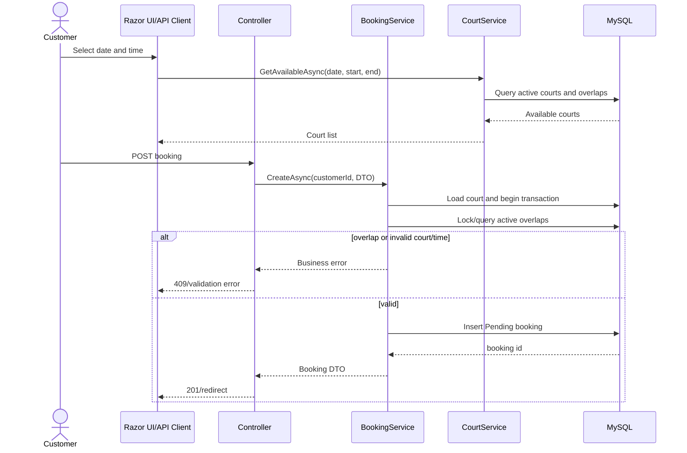

# Sequences and API Contract

## Booking sequence



## Core endpoints

| Method | Endpoint | Auth | Success | Main errors |
|---|---|---|---|---|
| GET | `/api/courts` | Public | 200 court list | 400 invalid range |
| GET | `/api/courts?date=...&startTime=...&endTime=...` | Public | 200 available courts | 409 invalid range |
| GET | `/api/courts/{id}` | Public | 200 court | 404 |
| POST | `/api/courts` | Admin + CSRF | 201 | 401/403/409 |
| PUT | `/api/courts/{id}` | Admin + CSRF | 200 | 401/403/404/409 |
| DELETE | `/api/courts/{id}` | Admin + CSRF | 204 | 401/403/404/409 |
| GET | `/api/bookings` | Admin/Customer | 200 scoped list | 401 |
| GET | `/api/bookings/{id}` | Admin/owner | 200 booking | 401/403/404 |
| POST | `/api/bookings` | Customer + CSRF | 201 Pending | 401/403/409 |
| POST | `/api/bookings/{id}/confirm` | Admin + CSRF | 204 | 401/403/404 |
| DELETE | `/api/bookings/{id}` | Admin/owner + CSRF | 204 | 401/403/404 |
| GET | `/api/security/csrf` | Authenticated | 200 token | 401 |
| GET | `/health` | Public | 200/503 | 503 |

## DTO examples

```json
{
  "courtId": 1,
  "bookingDate": "2026-10-01",
  "startTime": "18:00:00",
  "endTime": "20:00:00"
}
```

```json
{
  "bookingId": 10,
  "courtId": 1,
  "courtName": "Court One",
  "customerId": "user-id",
  "bookingDate": "2026-10-01",
  "startTime": "18:00:00",
  "endTime": "20:00:00",
  "status": "Pending",
  "totalPrice": 200000
}
```
